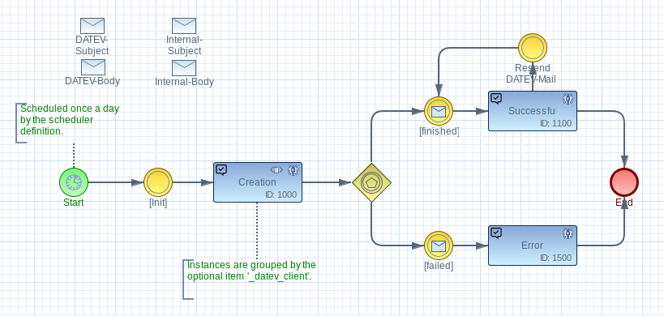

# imixs-datev-adapter

The _imixs-datev-adapter_ provides services to import and export data from DATEV.
The import feature allows the import of DATEV master data like 'Kontenbeschriftungen'.
The export feature allows the export of workflow invoice data into a DATEV file (Buchungstapel).

## DATEV Import

The imixs-datev-adapter provides mechanisms to import DATEV data. The import is based on the standard DATEV-Format which provides different data in CSV files. 

### The DataImportService

The DatevImportService EJB provides methods to read a Datev-Format file and import the data. 

	// test if supported CSV file?
	if (file.getName().endsWith(".csv")) {
		ByteArrayInputStream input = new ByteArrayInputStream(file.getContent());
		String result = datevImportService.importData(input, "ISO-8859-1");
		getImportData().replaceItemValue("log", result);
	} else {
		throw new PluginException(this.getClass().getName(), DatevImportService.IMPORT_ERROR,
				"File Format not supported: " + file.getName());
	}

The column 'Formatname' will be mapped to the item 'type'. 

#### Client and Consultant ID
	
A DATEV-Format file contains a header with different information. The Datev 'Berater' and 'Mandant' are mapped to each imported dataset 

 * Berater = _datev_consultant_id
 * Mandant = _datev_client_id 
	
This item fields which are part of each imported datev dataset can be used to import data from different sources. The data can be selected by the items. There for the items must be added into the imixs.properties entry: 'lucence.indexFieldListNoAnalyze'

	 lucence.indexFieldListNoAnalyze=....,_datev_client_id,_datev_consultant_id

#### Query DATEV data

Data can be selected by a query based on the type and the categories. See the following example:

	(type:"Kontenbeschriftungen" AND _datev_client_id:"00001" AND _datev_consultant_id:"00001")

## DATEV Export

### Model Based Configuration

The _imixs-datev-adapter_ can be combined with different kind of workflow models. The DATEV export is configured by the DATEV Model

This model must at least define an inital Task with the following Events:

 * DATEV Export Start = 100
 * DATEV Export Finished = 200
 * DATEV Export Failed = 300
 
Other tasks and events can be defined based on the required business logic. 

### The DatevScheduler

The DATEV export is managed by the DatevScheduler which is an implementation of the interface _org.imxis.workflow.scheduler.Scheduler_.
The scheduler configuration object must at least provide the following items:

 * \_model\_version = model version for the DATEV export
 * \_initial\_task = inital task ID

#### Data Source
 
The start event (100) must be linked to a report definition. The report describes the data source and the template to translate the 
data source into a DATEV file format. See the following example for a data source query defined by a report:

	(type:"workitem" AND $modelversion:"invoice-1.0.0")

This example configuration will select all invoices form the Model _invoice-1.0.0_. 

#### Grouping the Data Source

The SeapScheduler automatically groups the data source by the attribute \_datev\_client\_id. This feature is optional and used to generate separate process instances for each DATEV client. If the data is not grouped, the \_datev\_client\_id is usually hard coded in the xsl template. 

Selecting only invoices providing a \_datev\_client\_id can done by the following example query:

	(type:"workitem" AND $modelversion:"rechnungseingang-0.0.1" AND _datev_client_id:["" TO *]) 

Only in case of a grouped export the DatevSchedueler verifies the optional datev field '\_datev\_fiscal\_start'. This field is holding the start of the fiscal year by the datev client. This field must be part of the invoice. In xsl it can be added like in the following example:

	<xsl:variable name="fiscalstart" select="item[@name='_datev_fiscal_start']/value"/>
	<xsl:value-of select="format-dateTime($fiscalstart, '[Y0001][M01][D01]')"></xsl:value-of><xsl:text>;</xsl:text> 

If no grouping is necessary the fiscal year can be coded directly in the XSL template:

	<xsl:variable name="date" select="item[@name='$modified']/value"/>
	<xsl:value-of select="format-dateTime($date, '[Y0001]]')"></xsl:value-of><xsl:text>0101;</xsl:text> 

### Updating Invoices

In the sepa model the events _finished_ (200) and _failed_ (300)  can be combined with an "invoice_update" definition:

	<item name="invoice_update">
		<modelversion>1.0.0</modelversion>
		<processid>5800</processid>
		<activityid>100</activityid>
	</item>

The DatevScheduler automatically link the invoices with the DATEV export Workitem.
This definition is equals to the SplitAndJoin "subprocess_update" except with the item tag which is not supported for SEPA. 	

### XSL Transformation

The DATEV file is generated using the imixs-report functionality. The sepa report is assigned with a XSLT file to generate the output.
The DATEV file format is standardized. The DATEV interface is not public and not open source! 

#### XML Data Source

The xml data source is generated by the set of selected invoices defined by report definition and the DATEV export workitem itself. So the number of data entries is the count of invoices +1. 

To identify the type of document you can make use of the xsl select statement:

	....
	<xsl:template
		match="/data/document[normalize-space(item[@name = '$workflowgroup']/value) = 'DATEV-Export']">
		....
	</xsl:template>
	
	<xsl:template
		match="/data/document[normalize-space(item[@name = '$workflowgroup']/value) = 'Rechnungseingang']">
		....
	</xsl:template>
	.....

	

## Maven

The imxis-adapter-sepa module can be added into an applicaton module. The module provides CDI and EJB components. Optional the module contains also JSF pages to be used for frontends. 

Add the following maven dependency into a parent project:

	<!-- DATEV Adapter -->
	<dependency>
		<groupId>org.imixs.workflow</groupId>
		<artifactId>imixs-adapters-datev</artifactId>
		<version>${org.imixs.adapters.version}</version>
		<scope>provided</scope>
	</dependency>	