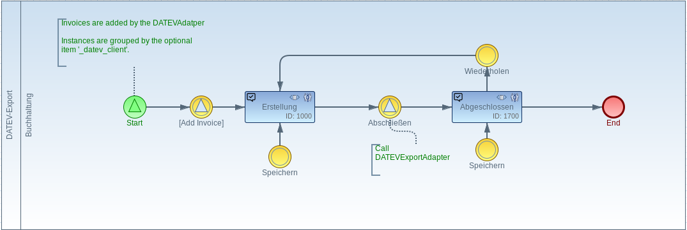
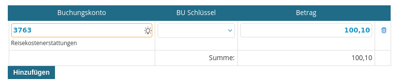
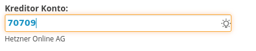

# DATEV Adapter

DATEV is a comprehensive software and service platform primarily used by tax consultants, auditors, and accountants in Germany. It is designed to streamline and automate various aspects of financial accounting, payroll, tax filing, and business management. The **Imixs Datev Adapter** is a interface to import and export Imixs Workflow Data and DATEV Data in a bidirectional way.
Since DATEV is a German software system, the Imixs-DATEV Adapter module is exceptionally described in German language. In any case, you can also ask questions about this project at any time in English.

# Überblick

Dieses Adaptermodul stellt Dienste zum Im- und Export von Daten aus DATEV zur Verfügung. Die Importfunktion ermöglicht den Import von DATEV-Stammdaten wie z.B. 'Kontenbeschriftungen' oder Debitoren/Kreditoren Stammdaten.
Die Exportfunktion ermöglicht den Export von Workflow-Belegdaten (z.B. Rechnungsdaten) in eine DATEV-Datei (Buchungstapel).

## DATEV Import

Der imixs-datev-Adapter bietet Mechanismen zum Import von DATEV-Daten. Der Import basiert auf dem Standard-DATEV-Format, das verschiedene Daten in CSV-Dateien bereitstellt.

Die EJB `DatevImportService` stellt Methoden zur Verfügung, um eine Datei im Datev-Format zu lesen und die Daten zu importieren. Beispiel:

```java
    // test if supported CSV file?
    if (file.getName().endsWith(".csv")) {
    	ByteArrayInputStream input = new ByteArrayInputStream(file.getContent());
    	String result = datevImportService.importData(input, "ISO-8859-1");
    	getImportData().replaceItemValue("log", result);
    } else {
    	throw new PluginException(this.getClass().getName(), DatevImportService.IMPORT_ERROR,
    			"File Format not supported: " + file.getName());
    }
```

Die Spalte 'Formatname' wird dabei automatisch auf das `type` item gemapped.

#### Berater und Mandant ID

Eine Datei im DATEV-Format enthält einen Header mit unterschiedlichen Informationen. Die Eigenschaften 'Berater' und 'Mandant' werden dabei jedem importierten Datensatz wie folgt zugeordnet

- Berater = `datev.consultant.id`
- Mandant = `datev.client.id`

Diese Felder, die Teil jedes importierten datev-Datensatzes sind, können verwendet werden, um Daten aus verschiedenen Quellen zu importieren und zu benutzen. Für die lucene Suche wird beim Import ein generischer Primärschlüssel im item `name` in folgendem Format erzeugt:

    `consultenID + "_" + clientID + "_" + keyValue`

Wobei hier das `keyValue` dem primärschlüssel des Datensatzes entspricht - beispielsweise der Kontonummer.

Daten können auf diese Weise durch eine einfache Abfrage basierend auf dem Typ und den Kategorien gesucht werden. Das folgende Beispiel sucht das konto mit der Nummer 1400 für den Berater/Mandant 00001/00001:

    (type:"Kontenbeschriftungen" AND name:"00001_00001_1400")

## DATEV Export

Der DATEV-Export kann über einen SignalAdapter innerhalb eines Workflow-Modells erzeugt werden.

    org.imixs.workflow.datev.adapter.DATEVRefAddAdapter

Der Adapter prüft automatisch, ob bereits ein DATEV-Belegstapel Export für den aktuellen Buchungszeitraum und den 'datev.client.id' existiert. Ist dies nicht der Fall, erstellt der Adapter automatisch einen neuen Belegstapel und fügt den aktuellen Vorgang ein.

Für das Einfügen eines Beleges in den DATEV Belegsapel müssen im Workitem folgende Felder existieren:

| item Name          | DATEV Feld   | Beispiel        |
| ------------------ | ------------ | --------------- |
| datev.betrag       | Umsatz       | 67890,12        |
| datev.belegfeld1   | Belegfeld1   | Belegnummer 001 |
| datev.konto        | Konto        |
| datev.gegenkonto   | Gegenkonto   |
| datev.buschluessel | Buschluessel |

Auf diese weise können unterschiedliche Prozessdaten in einen Belegstapel zusammgefasst werden. Um ein Mapping eines workflow Items auf ein DATEV item zu erhalten kann dieses im BPMN Result event angelegt werden. Beisiel:

```xml
   <item name="datev.betrag"><itemvalue>invoice.total</itemvalue></item>
   <item name="datev.belegfeld1"><itemvalue>invoice.number</itemvalue></item>
   <item name="datev.gegenkonto"><itemvalue>cdtr.number</itemvalue></item>
   ...
```

Der DATEV Export Workflow kann vollständig über das DATEV Export Modell gesteuert werden.



Um einen verknüpfte Vorgang aus dem Buchunsstapel zu entfernen, kann der RemoveAdapter verwendet werden.

    org.imixs.workflow.datev.adapter.DATEVRefRemoveAdapter

Um den Buchunstapel zu erzeugen kann der ExecuteAdatper verwendet weden

    org.imixs.workflow.datev.adapter.DATEVExecuteAdapter

### XSL Transformation

Die DATEV-Datei wird mit Hilfe der imixs-report-Funktionalität erzeugt. Dem DATEV-Report wird eine XSLT-Datei zugeordnet, um die Ausgabe zu erzeugen.
Das DATEV-Dateiformat ist standardisiert.
Für den DATEV Standard CSV Export muss ein Imixs Report definiert werden. Für das DATEV XML-Format sind zwei Reports erforderlich. Der Report für Belege definiert die Belegauswahl und das XSL, um einen Beleg in die entsprechende XML-Datei zu transformieren. Der Bericht für Dateianhänge (Belegbilder) wird benötigt, um die XSLT-Definition zu definieren, mit der die XML-Datei Dokument.xml generiert wird.

**Hinweis:** Die DATEV-Schnittstelle ist nicht öffentlich und nicht Open Source! Sie benötigen die offizielle DATEV-Dokumentation, um Informationen darüber zu erhalten, wie die CSV- und XML-Dateien gestaltet sein müssen.

#### XML Data Source

Die XML-Datenquelle wird aus der Liste der ausgewählten Belege erzeugt, die durch die Report Schnittstelle definiert sind, und dem DATEV-Export-Workitem selbst generiert. Die Anzahl der Dateneinträge entspricht damit der Anzahl der Belege+1.

Um den Dokumenttyp zu identifizieren, können Sie die entsprechenden xsl select-Anweisung verwenden:

```xml
    ....
    <xsl:template
    	match="/data/document[normalize-space(item[@name = '$workflowgroup']/value) = 'DATEV-Export']">
    	....
    </xsl:template>

    <xsl:template
    	match="/data/document[normalize-space(item[@name = '$workflowgroup']/value) = 'Rechnungseingang']">
    	....
    </xsl:template>
    .....
```

## Formular

Es gibt auch benutzerdefinierte Formularelemente, die für typische Datev-Prozesse verwendet werden können

### Booking Table

Über die custom form-section `datev/booking_account` kann ein Formularbereich für eine Buchungstabelle angezeigt werden

```
  <imixs-form-section type="custom" path="datev/booking_account" label="Buchungen" />
```



### Search Konto

Über das custom form part `datev/account_search` kann ein Eingabesuchfeld für Debitoren-/Kreditorenkonten angezeigt werden.

```xml
    <item name="datev.cdtr" type="custom"
		path="datev/account_search"
        label="Kreditor Konto:"
		required="true" />
```



Sie können das Suchergebnis optional einschränken, indem Sie einen regulären Ausdruck über das Attribut 'options' angeben.
Wenn Sie z. B. nur Kontonummern filtern möchten, die mit "7" beginnen, können Sie einen regulären Ausdruck wie folgt hinzufügen:

```xml
   <item name="datev.cdtr" type="custom"
   		path="datev/account_search"
        label="Kreditor Konto:"
		options="^7.*"
		required="false" />
```

Durch diesen Filter werden alle Kontonummern gefiltert, die mit "7" beginnen. Die ^ Ankerzeichen im regulären Ausdruck bedeuten, dass der String mit "7" beginnen muss, und .\* bedeutet, dass nach der "7" ein beliebiges Zeichen folgen kann.

## Maven

Das Modul imxis-adapter-datev kann in jedes Maven Projekt eingefügt werden. Das Modul stellt CDI- und EJB-Komponenten zur Verfügung. Optional enthält das Modul auch JSF-Seiten, die für Frontends verwendet werden können.

Fügen Sie die folgende Maven-Abhängigkeit zu einem übergeordneten Projekt hinzu:

```xml
    <!-- DATEV Adapter -->
    <dependency>
    	<groupId>org.imixs.workflow</groupId>
    	<artifactId>imixs-adapters-datev</artifactId>
    	<version>${org.imixs.adapters.version}</version>
    	<scope>provided</scope>
    </dependency>
```
