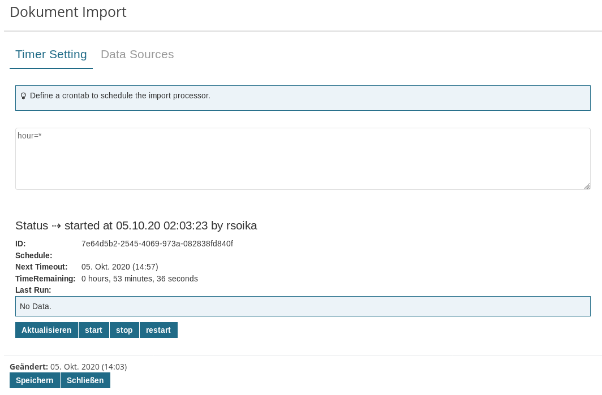

# Apache Importer Adapter

The Imixs Import Adapter is a generic import adapter service to be used to import documents form various sources. An import scheduler sends CDI events to be processed by specific import observers. The following import sources are supported:

 - FTP - import form a ftp server 
 - IMAP - import form an email box via IMAP
 
## Web UI

The Importer adapter provides a JSF Web UI component to be used for jsf applications. This ui component is optional and can be implement in customized way. 

