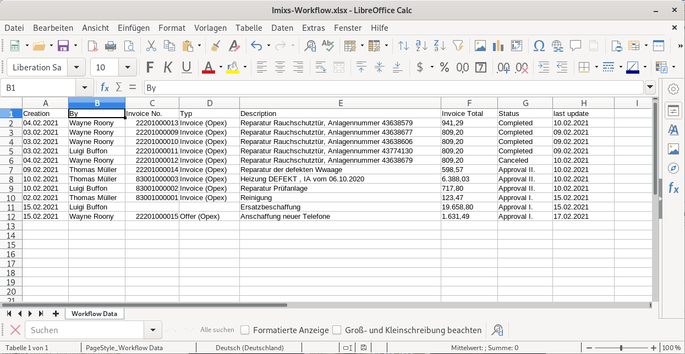

# Imixs Apache POI

This adapter module provides services to export the result of an Imixs-Report into a Excel file. The implementation is based on
[Apache POI](https://poi.apache.org/). 

We use XSSF to read and write an OOXML Excel file (XLSX). 

## The Rest API

The POI Adapter module extends the [Imixs-Workflow Report Rest API](https://www.imixs.org/doc/restapi/reportservice.html) with an additional resource named 'poi'. 

| URI                                           | Description                               					   | 
|-----------------------------------------------|------------------------------------------------------------------|
| /poi/report/{name}.xlsx                       | generates an Excel file containing the result-set of a report definition                        |

The contentType and the processing instrcutions (XSL) of a  report definition will be ignored.

# Development

## Maven

The imxis-adapter-sepa module can be added into an applicaton module. The module provides CDI and EJB components. Optional the module contains also JSF pages to be used for frontends. 

Add the following maven dependency into a parent project:

	<!-- POI Adapter -->
	<dependency>
		<groupId>org.imixs.workflow</groupId>
		<artifactId>imixs-adapters-poi</artifactId>
		<version>${org.imixs.adapters.version}</version>
		<scope>provided</scope>
	</dependency>
	