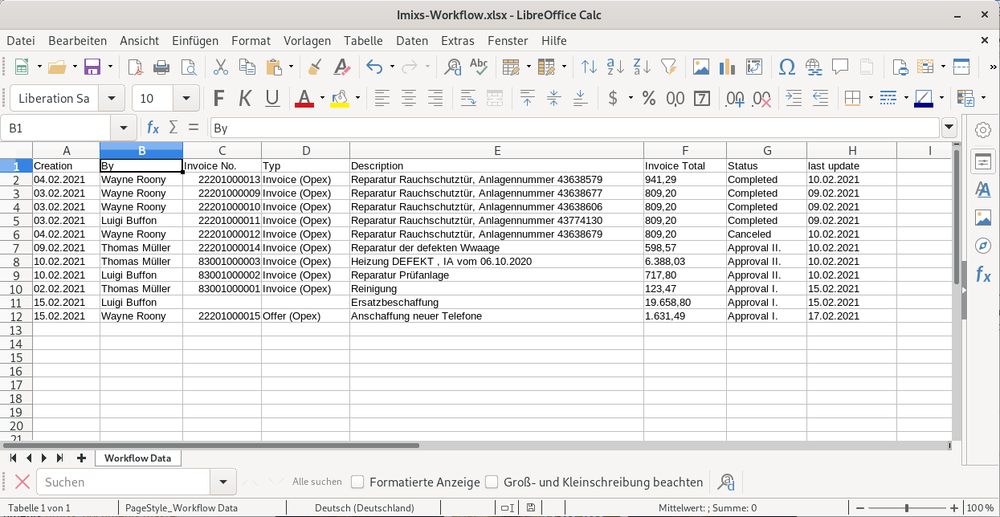

# Imixs Apache POI

This adapter module provides services to export the result of an Imixs-Report into a Excel file. The implementation is based on
[Apache POI](https://poi.apache.org/). 

We use XSSF to read and write an OOXML Excel file (XLSX). 

## Imixs-Office-Workflow

The project [Imixs-Office-Worklfow](https://github.com/imixs/imixs-office-workflow) provides a interface to export Imixs-Reports with one of the following content types:

 - vnd.openxmlformats-officedocument. spreadsheetml.sheet 
 - application/vnd.ms-excel

The feature is automatically integrated into the UI

## The Rest API

The POI Adapter module extends the [Imixs-Workflow Report Rest API](https://www.imixs.org/doc/restapi/reportservice.html) with an additional resource named 'poi'. 

| URI                                           | Description                               					   | 
|-----------------------------------------------|------------------------------------------------------------------|
| /poi/report/{name}.xlsx                       | generates an Excel file containing the result-set of a report definition                        |

The contentType and the processing instrcutions (XSL) of a  report definition will be ignored.

# Development

## Maven

The imixs-adapter-poi module can be added into an application module. The module provides CDI and Rest API components. 

Add the following maven dependency into a parent project:

	<!-- POI Adapter -->
	<dependency>
		<groupId>org.imixs.workflow</groupId>
		<artifactId>imixs-adapters-poi</artifactId>
		<version>${org.imixs.adapters.version}</version>
		<scope>provided</scope>
	</dependency>
	