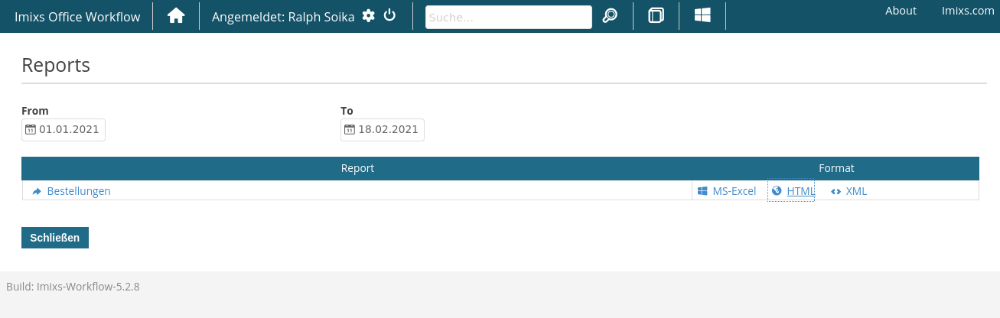

# Imixs Apache POI

This adapter module provides services to export the result of an Imixs-Report into a Excel file. The implementation is based on
[Apache POI](https://poi.apache.org/). 

We use XSSF to read and write an OOXML Excel file (XLSX). 

## Imixs-Office-Workflow

The project [Imixs-Office-Worklfow](https://github.com/imixs/imixs-office-workflow) provides a interface to export Imixs-Reports with one of the following content types:

 - vnd.openxmlformats-officedocument. spreadsheetml.sheet 
 - application/vnd.ms-excel

The feature is automatically integrated into the UI

## The Rest API

The POI Adapter module extends the [Imixs-Workflow Report Rest API](https://www.imixs.org/doc/restapi/reportservice.html) with an additional resource named 'poi'. 

| URI                                           | Description                               					   | 
|-----------------------------------------------|------------------------------------------------------------------|
| /poi/report/{name}.xlsx                       | generates an Excel file containing the result-set of a report definition                        |

The contentType and the processing instrcutions (XSL) of a  report definition will be ignored.

## POI FindReplace Adapter

With the adapter class *org.imixs.workflow.poi.POIFindReplaceAdapter* it is possible to update Word documents (.docx) or Excel documents (.xls, .xlsx).
The adapter can replace text fragments in a paragraph.

The adapter uses the method XWPFRun.setText(String) and goes through the file until it finds the corresponding paragraph. The result document is saved in the current workitem.

The following example searches for an attachment with the name 'Agreement-????.docx' and replaces the text fragments *[company.name]*, *[company.country]* and *[contract.startdate]* with the corresponding item values.

      <poi-update name=
        "filename">Agreement-<itemvalue>numsequencenumber</itemvalue>.docx</poi-update>
        <poi-update name="findreplace">
               <find>[company.name]</find>
               <replace><itemvalue>company.name</itemvalue></replace>
        </poi-update>
        <poi-update name="findreplace">
               <find>[company.country]</find>
               <replace><itemvalue>company.country</itemvalue></replace>
        </poi-update>
        <poi-update name="findreplace">
               <find>[contract.startdate]</find>
               <replace><itemvalue format=
        "EEE, MMM d, yyyy">contract.start</itemvalue></replace>
       </poi-update>

If you have a Excel Sheet than you can replace cell values be specifying the cell position:

		<poi-update name="filename">Invoice-<itemvalue>numsequencenumber</itemvalue>.xlsx</poi-update>
		<poi-update name="findreplace">
		       <find>A:10</find>
		       <replace> <itemvalue>company.name</itemvalue></replace>
		</poi-update>

### Regular Expressions

You can also define the filename as a pattern including regulare expressins. See the following example:

	<poi-update name="filename">.*<itemvalue>numsequencenumber</itemvalue>\.docx</poi-update>

This expression will match all files ending with the sequence number and the file extension '.docx'

## POI CopyContent Adapter

With the adapter class *org.imixs.workflow.poi.POICopyContentAdapter* it is possible to update the workitem items with cell values from Excel documents (.xls, .xlsx).
The adapter can copy values form a cell. 

The following example searches for an attachment with the name 'Invoice-????.xlsx' and copies the cell F:26  into the item 'invoice.total'

	<poi-copy name="filename">Invoice-<itemvalue>numsequencenumber</itemvalue>.xlsx</poi-copy>
	<poi-copy name="copy">
	       <find>F:26</find>
	      <item>invoice.total</item>
	      <type>number</type>
	</poi-copy>
     
You can convert the value into different types

 - date - Java Date object
 - number - Java Double 
 - text - String

# Development

## Maven

The imixs-adapter-poi module can be added into an application module. The module provides CDI and Rest API components. 

Add the following maven dependency into a parent project:

	<!-- POI Adapter -->
	<dependency>
		<groupId>org.imixs.workflow</groupId>
		<artifactId>imixs-adapters-poi</artifactId>
		<version>${org.imixs.adapters.version}</version>
		<scope>provided</scope>
	</dependency>
	