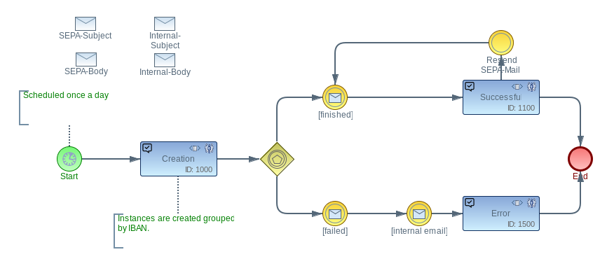

# imixs-sepa-adapter

The _imixs-sepa-adapter_ provides services to export workflow data into a sepa file.

## Model Based Configuration

The _imixs-sepa-adapter_ can be combined with different kind of workflow models. The SEPA export is configured by the SEPA Model

This model must at least define an inital Task with the following Events:

 * SEPA Export Start = 100
 * SEPA Export Finished = 200
 * SEPA Export Failed = 300
 
Other tasks and events can be defined based on the required business logic. 

## The SepaScheduler

The SEPA export is managed by the SeapScheduler which is an implementation of the interface _org.imxis.workflow.scheduler.Scheduler_.
The scheduler configuration obejct must at least prvide the following items:

 * _query = invoice selector (lucene query)
 * _gropby = optional group by definition to group selected invoices
 * _IBAN = default IBAN for the SEPA export file 
 * _BIC = default BIC for the SEPA export file
 
The SepaScheduler automatically select invoices based on the definition provided by the item _query. 
Selected invoices can be optional grouped by the definition of the item _groupby. 

Example:

	_query= (type:"workitem" AND $modelversion:"invoice-1.0.0")
	
	_groupBy= _mandator
	
This example configuration will select all invoices form the Model _invoice-1.0.0_. The selected invoices will than be grouped by the applied invoice item _mandator_. For each group a separate SEPA Export Workflow will be started.   
The item _groupBy can be used in various ways. For example if an invoice provide a mandator IBAN, than the invoices can be grouped by tis IBAN attribute. This allows the export of separate SEPA files for differnet mandators. 

## Updating Invoices

In the sepa model the success and failed events can be combined with an "invoice_update" definition:

	<item name="invoice_update">
		<modelversion>1.0.0</modelversion>
		<processid>5800</processid>
		<activityid>100</activityid>
	</item>

The SepaScheduler automatically link the invoices with the sepa export Workitem.
This definition is equals to the SplitAndJoin "subprocess_update" except with the item tag which is not supported for SEPA. 	

## XSL Transformation

The sepa file is generated using the imixs-report functionality. The sepa report is assigned with a XSLT file to generate the output.
The sepa file format is standardized. See details [here](http://www.sepaforcorporates.com/sepa-implementation/sepa-xml-in-a-nutshell/).

### XML Data Source

The xml data source is generated by the set of selected invoices defined by report definition and the sepa-export workitem itself. So the numer of data entries is the count of invoices +1. 

To identify the type of document you can make use of the xsl select statement:

	<xsl:apply-templates
		select="/data/document[normalize-space(item[@name = '$workflowgroup']/value) = 'Rechnungseingang']" />
							
sele