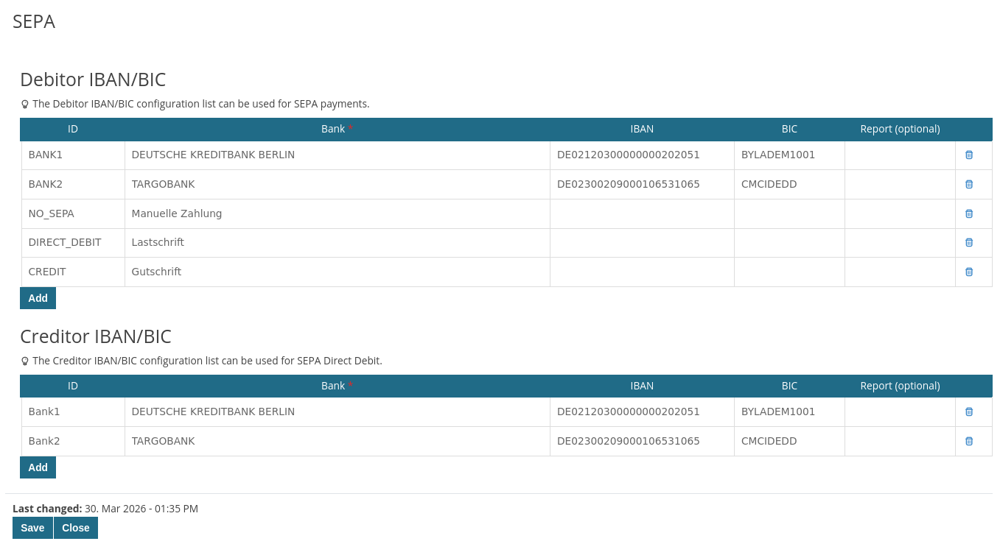
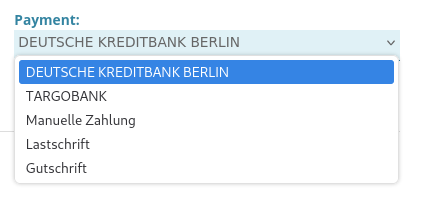
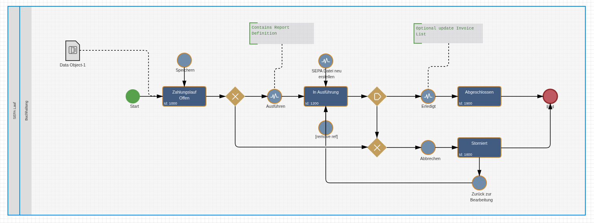

# Imixs SEPA Adapter

This adapter module provides services to export workflow invoice data into a **SEPA** file.
With the SEPA Adapter you can group paymens in a SEPA Workflow request. An invoice will simply hold a reference ($workitemref) pointing to the SEPA payment run. The SEPA payment run can be executed manually or scheduled (timer events)

An invoice instance linked to an SEPA Export must at least provide the following items:

**Payment**

- dbtr.IBAN = default debitor IBAN
- dbtr.BIC = default debitor BIC
- dbtr.NAME = default debitor NAME

Aligned to the SEPA standard an debit advice may provide optional the following items.

**Debit advice**

- cdtr.IBAN = default debitor IBAN
- cdtr.BIC = default debitor BIC
- cdtr.NAME = default debitor NAME

## Basic Configuration

The Imixs-SEPA-Adapter provides a basic configuration document (type=scheduler name=SEPA) holding parameters for debitor and creditor bank data.



In the SEPA configuration form multiple debitor options can be configured. In this way invoices can be assigned to different dbtr.iban attributes
This feature is optional and used to generate separate process instances for each debitor.



**Note:** In an versions before 3.2.2 the sepa module use a different configuration and processing logic. You can still use the deprecated adapter classes if needed. See the section [deprecated sepa config](./DEPRECATED.md)

### Grouping Invoices by custom attributes

The SEPA Adapter class `org.imixs.workflow.sepa.adapter.SEPAAdapter` is a generic signal adapter to group and execute a SEPA payment run.

```xml
<sepa name="ADD|REMOVE|EXECUTE">
   <workflowgroup>Payment Run</workflowgroup>
   <init.task>1000</task>
   <init.event>20</event>
   <key><itemvalue>invoice.payment.type</itemvalue></key>
   <type>IN|OUT</type>
</sepa>
```

| SEPA Mode | Tag             | Description                                                                           |
| --------- | --------------- | ------------------------------------------------------------------------------------- |
| ADD       |                 | Adds the current workitem into a sepa group. If no group exits a new group is created |
|           | `key`           | The bank ID from the sepa configuration                                               |
|           | `workflowgroup` | The name of the workflow group of the SEPA workflow                                   |
|           | `init.task`     | The inital task id to create a new sepa group                                         |
|           | `init.event`    | The inital taseventk id to create a new sepa group                                    |
|           | `debug`         | Optional boolean to print debug information                                           |
| REMOVE    |                 | Removes the current worktiem from a sepa group                                        |
|           | `key`           | The bank ID from the sepa configuration                                               |
|           | `workflowgroup` | The name of the workflow group of the SEPA workflow                                   |
|           | `debug`         | Optional boolean to print debug information                                           |
| EXECUTE   |                 | Executes a sepa run by the given report definition                                    |

## SEPA Workflow

The SEPA Export is controlled by a corresponding workflow BPMN 2.0 model:



This model must at least define an initial Task as also the event to create and execute the SEPA run.

## XSL Transformation

The SEPA file is generated using the imixs-report functionality. The SEPA report is assigned with a XSLT file to generate the output.
The SEPA file format is standardized. See details [here](http://www.sepaforcorporates.com/sepa-implementation/sepa-xml-in-a-nutshell/).

### XML Data Source

The XML data source is generated by the set of selected invoices defined by report definition and the sepa-export workitem itself. So the number of data entries is the count of invoices +1.

To identify the type of document you can make use of the xsl select statement:

    ....
    <xsl:template
    	match="/data/document[normalize-space(item[@name = '$workflowgroup']/value) = 'SEPA-Export']">
    	....
    </xsl:template>

    <xsl:template
    	match="/data/document[normalize-space(item[@name = '$workflowgroup']/value) = 'Rechnungseingang']">
    	....
    </xsl:template>
    .....

### XSD pain.001.003.03

To align the resulting sepa.xml file with the XSD pain.001.003.03, we do transform some of the origin data from the XML source.

**MsgId**: The tags 'MsgId' and 'PmtInfId' may not be longer as 35 characters. For that reason we remove the '-' from the $uniqueid to shorten the message ids.

    ...
    <MsgId>
    	<xsl:value-of
    		select="replace($exportWorkitem/item[@name='$uniqueid']/value, '-', '')" />
    </MsgId>
    ...

**IBAN**: The tags 'iban' may not contain blanks which in general is valid to input iban. For that reason we remove the ' ' from the corresponding items.

    ...
    <CdtrAcct>
    	<Id>
    		<IBAN>
    			<xsl:value-of select="replace(item[@name='cdtr.iban']/value, ' ', '')" />
    		</IBAN>
    	</Id>
    </CdtrAcct>
    ...

### Apply an Optional XSL Template

It is also possible to apply an optional XSL Template during the XSL transformation. The template must to be defined in a Imixs-Report file and the report name has to be configured either in the DBTR Options or in the invoice by the item 'sepa.report'.

## IBAN / BIC Input Validation

To validate if the provided IBAN/BIC data, the following plugin can be added into a model:

    org.imixs.workflow.sepa.plugins.IBANBICPlugin

The plugin validates the following input items:

- dbtr.iban
- dbtr.bic
- cdtr.iban
- cdtr.bic

The validation is skipped in case no value is provided.

The error message can be configured by the resource bundles 'app' or 'custom' with the following message key:

    ERROR_INVALID_IBANBIC=Your input of the IBAN/BIC is invalid. Please check your data.

For the IBAN/BIC validaten the open source library https://github.com/SpeedBankingDe/iban-commons is used

### Strict Validation

In the default mode the plugin ignores spaces between the digits of IBAN/BIC independent from its position. If you want to force a strict validation than you can set the environment variable _SEPA_VALIDATION_STRICT_ to 'true'

    SEPA_VALIDATION_STRICT=true

In this mode only correctly formated IBAN/BIC strings or strings without spaces will be accepted. See the following example:

    # SEPA_VALIDATION_STRICT=false (default)
    NL73HIYA0048846703       = OK
    NL 73HIYA0048846703      = OK

    # SEPA_VALIDATION_STRICT=true
    NL73HIYA0048846703       = OK
    NL73 HIYA 0048 8467 03   = OK
    NL 73HIYA0048846703      = NOT OK

# Development

## Maven

The imxis-adapter-sepa module can be added into an application module. The module provides CDI and EJB components. Optional the module contains also JSF pages to be used for frontends.

Add the following maven dependency into a parent project:

    <!-- SEPA Adapter -->
    <dependency>
    	<groupId>org.imixs.workflow</groupId>
    	<artifactId>imixs-adapters-sepa</artifactId>
    	<version>${org.imixs.adapters.version}</version>
    	<scope>provided</scope>
    </dependency>
