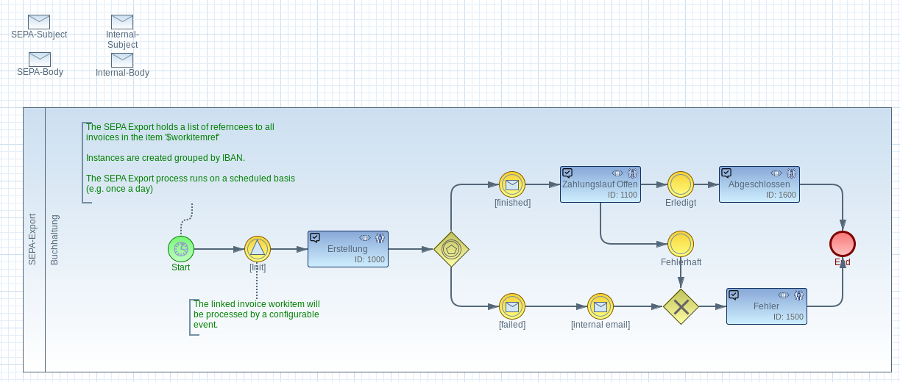

# imixs-sepa-adapter

The _imixs-sepa-adapter_ provides services to export workflow invoice data into a sepa file.

## Model Based Configuration

The _imixs-sepa-adapter_ can be combined with different kind of workflow models. The SEPA export is configured by the SEPA Model

This model must at least define an inital Task with the following Events:

 * SEPA Export Start = 100
 * SEPA Export Finished = 200
 * SEPA Export Failed = 300
 
Other tasks and events can be defined based on the required business logic. 

## The SepaScheduler

The SEPA export is managed by the SeapScheduler which is an implementation of the interface _org.imxis.workflow.scheduler.Scheduler_.
The scheduler configuration object must at least provide the following items:

 * \_model\_version = model version for the SEPA export
 * \_initial\_task = inital task ID
 * \_dbtr\_IBAN = default IBAN for the SEPA export file 
 * \_dbtr\_BIC = default BIC for the SEPA export file
 
The start event (100) must be linked to a report definition. The report describes the data source and the template to translate the 
data source into a SEPA file format. See the following example for a data source query defined by a report:

	(type:"workitem" AND $modelversion:"invoice-1.0.0")

This example configuration will select all invoices form the Model _invoice-1.0.0_. 

### Grouping the Data Source

The SeapScheduler automatically groups the data source by the attribute \_dbtr\_iban. This feature is optional and used to generate seperate process instances for each debitor. 

## Updating Invoices

In the sepa model the events _finished_ (200) and _failed_ (300)  can be combined with an "invoice_update" definition:

	<item name="invoice_update">
		<modelversion>1.0.0</modelversion>
		<processid>5800</processid>
		<activityid>100</activityid>
	</item>

The SepaScheduler automatically link the invoices with the sepa export Workitem.
This definition is equals to the SplitAndJoin "subprocess_update" except with the item tag which is not supported for SEPA. 	

## XSL Transformation

The sepa file is generated using the imixs-report functionality. The sepa report is assigned with a XSLT file to generate the output.
The sepa file format is standardized. See details [here](http://www.sepaforcorporates.com/sepa-implementation/sepa-xml-in-a-nutshell/).

### XML Data Source

The xml data source is generated by the set of selected invoices defined by report definition and the sepa-export workitem itself. So the numer of data entries is the count of invoices +1. 

To identify the type of document you can make use of the xsl select statement:

	....
	<xsl:template
		match="/data/document[normalize-space(item[@name = '$workflowgroup']/value) = 'SEPA-Export']">
		....
	</xsl:template>
	
	<xsl:template
		match="/data/document[normalize-space(item[@name = '$workflowgroup']/value) = 'Rechnungseingang']">
		....
	</xsl:template>
	.....

