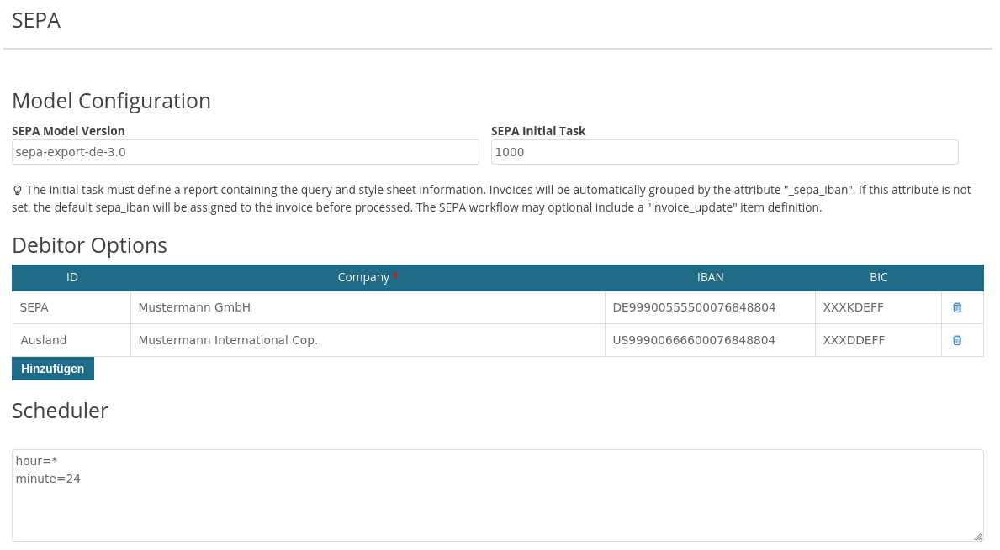

# Imixs SEPA Adapter

This adapter module provides services to export workflow invoice data into a sepa file.

The SEPA Adapter can be used in the following different modes:

 - manual mode - an invoice workitem can be added via an SignalAdapter to a SEPA Export which will be executed by a user
 - scheduler mode - invoices are collected periodically by a scheduler which is creating the SEPA Export instances. 
 - parallel mode - in this case an invoice is ferst linked with a sepa-request workitem which is later processed by the scheduler

The manual mode is the recommended mode as it gives the user a maximum of control. 

An invoice instance linked to an SEPA Export must at least provide the following items:

 * dbtr.IBAN = default debitor IBAN  
 * dbtr.BIC = default debitor BIC 
 * dbtr.NAME = default debitor NAME 
 
Aligned to the SEPA standard an invoice can provide optional the following items. 

 * cdtr.IBAN = default debitor IBAN  
 * cdtr.BIC = default debitor BIC 
 * cdtr.NAME = default debitor NAME 

## Basic Configuration

The Imixs-SEPA-Adapter provides a basic configuration document (type=scheduler name=SEPA) holding parametes for generating a SEPA Workitem.

The SEPA Model Version and the SEPA Initial Task are mandatory and are used to create a new SEPA Export workflow instance. The Event 100 is also mandatory for the initial Task

### Grouping Invoices by custom attributes

The SEPA Adaper automatically groups invoice workitems by the attribute *dbtr.iban*. 
In the SEPA configuration form multiple debitor options can be configured. In this way invoices can be assigned to different dbtr.iban attributes
This feature is optional and used to generate separate process instances for each debitor. 

If the item *dbtr.iban* is not provided by an invoice than the adapter class lookups the item *payment.type* and updates the following items based on the sepa dbtr option list:

 - dbtr.name
 - dbtr.iban
 - dbtr.bic

In a JSF page the sepa options can be selected using the SepaController:

	<h:selectOneMenu required="true" value="#{workflowController.workitem.item['payment.type']}" >
		<c:forEach items="#{sepaController.dbtrList}" var="dbtr">	
			<f:selectItem itemLabel="#{dbtr.item['name']}" itemValue="#{dbtr.item['name']}" />	
		</c:forEach>
		<f:selectItem itemLabel="Direct Debit" itemValue="direct_debit" />		
	</h:selectOneMenu>

	
## Manual Mode	

In the manual mode the SEPA Export is generated by a SignalAdapter within a Invoice Workflow model. 

    org.imixs.workflow.sepa.adapter.SEPARefAddAdapter

The adapter automatically verifies if SEPA Export for the given dbtr.iban item already exists. If not, the adapter creates a new one.  

The SEPA Export can be fully controlled by the user

This model must at least define an initial Task with the following Events:

 * add Invoice reference = 100
 * remove invoice reference = 200

To remove a linked invoice the RemoveAdapter can be used. 

    org.imixs.workflow.sepa.adapter.SEPARefRemoveAdapter

To execute a SEPA Export the ExecuteAdatper can be used

    org.imixs.workflow.sepa.adapter.SEPAExecuteAdapter

### Configuration

The SignalAdaper need the model-version and task-id to create a new SEPA export. This can either be configured in the basic configuration.

Optional this data can be overwritten by the event configuration:

	<sepa-export name="modelversion">sepa-export-manual-de-3.0</sepa-export>
	<sepa-export name="task">1000</sepa-export>

	
	
## Scheduler Mode	
	
In the scheduler mode the invoice workflow does not link an workitem to a SEPA Export. Instead a scheduler can be configured to collect invoices periodically.  The SEPA export is an implementation of the interface *org.imxis.workflow.scheduler.Scheduler*.

This model must at least define an inital Task with the following Events:

 * SEPA Export Start = 100
 * SEPA Export Completed = 200
 * SEPA Export Failed = 300
 
Other tasks and events can be defined based on the required business logic. The module supports two kinds of models

### SEPA Linked Model

In the default setup the SEPA module links the invoices into the SEPA export workitem and updates the invoiced during the export process. For this purpose the init event defines the processing instruction for the linked invoice workitems:

	<sepa name="invoice_update">
		<modelversion>(^rechnungseingang)</modelversion>
		<task>5800</task>
		<event>300</event>
	</sepa> 

Of course it is possible to define separate SEPA processing instructions for the export result 'SEPA Export Completed' and 'SEPA Export Failed'. 

### SEPA Parallel Model

As an alternative to the linked model a parallel SEPA model can be used to decouple the invoice process from the SEPA export process. In this case for each invoice a separate SEPA-Request document (type=sepa) is expected, which is processed by the SEPA export independent form the invoice workflow.

Also in case of a SEPA parallel model the SEPA Service expects a processing instruction for the linked  SEPA-Request workitems:

	<sepa name="invoice_update">
		<modelversion>(^rechnungseingang)</modelversion>
		<task>5800</task>
		<event>300</event>
	</sepa> 

Also in this model type separate SEPA processing instructions for the export result 'SEPA Export Completed' and 'SEPA Export Failed' can be defined. 

### Data Source
 
The start event (100) must be linked to a report definition. The report describes the data source and the template to translate the 
data source into a SEPA file format. See the following example for a data source query defined by a report:

	(type:"workitem" AND $modelversion:"invoice-1.0.0")

This example configuration will select all invoices form the Model _invoice-1.0.0_. 

### Updating Invoices / SEPA Request

In the sepa model the event *init* may optional contain a "sepa invoice_update" definition to update the invoice reference. This feature is needed only for the Scheduled-Mode.  :

	<sepa name="invoice_update">
		<modelversion>1.0.0</modelversion>
		<processid>5800</processid>
		<activityid>100</activityid>
	</sepa>

**Note:** In case of a sepa-parallel model the sepa request instance is updated.
 
The SepaScheduler automatically link the invoices with the SEPA export Workitem.
This definition is equals to the SplitAndJoin "subprocess_update" except with the item tag which is not supported for SEPA. 	

### Maximum Invoices to be Processed

The *SepaScheduler* has an upper limit to process open invoices within one run. This limit is set to 100 invoices. You can overwrite this limit with the environment setting '*sepa.invoices.maxcount*'. The property can be set either in the imixs.properties or provided as an environment variable:

	SEPA_INVOICES_MAXCOUNT=200

In case you are running in timeouts you should lower the *sepa.invoices.maxcount*.

## XSL Transformation

The SEPA file is generated using the imixs-report functionality. The SEPA report is assigned with a XSLT file to generate the output.
The SEPA file format is standardized. See details [here](http://www.sepaforcorporates.com/sepa-implementation/sepa-xml-in-a-nutshell/).

### XML Data Source

The XML data source is generated by the set of selected invoices defined by report definition and the sepa-export workitem itself. So the number of data entries is the count of invoices +1. 

To identify the type of document you can make use of the xsl select statement:

	....
	<xsl:template
		match="/data/document[normalize-space(item[@name = '$workflowgroup']/value) = 'SEPA-Export']">
		....
	</xsl:template>
	
	<xsl:template
		match="/data/document[normalize-space(item[@name = '$workflowgroup']/value) = 'Rechnungseingang']">
		....
	</xsl:template>
	.....

### XSD pain.001.003.03

To align the resulting sepa.xml file with the XSD pain.001.003.03, we do transform some of the origin data from the XML source.

__MsgId__: The tags 'MsgId' and 'PmtInfId' may not be longer as 35 characters. For that reason we remove the '-' from the $uniqueid to shorten the message ids. 

	...
	<MsgId>
		<xsl:value-of
			select="replace($exportWorkitem/item[@name='$uniqueid']/value, '-', '')" />
	</MsgId>
	...

__IBAN__: The tags 'iban' may not contain blanks which in general is valid to input iban. For that reason we remove the ' ' from the corresponding items.

	
	...
	<CdtrAcct>
		<Id>
			<IBAN>
				<xsl:value-of select="replace(item[@name='cdtr.iban']/value, ' ', '')" />
			</IBAN>
		</Id>
	</CdtrAcct>
	...

### Apply an Optional XSL Template

It is also possible to apply an optional XSL Template during the XSL transformation. The template must to be defined in a Imixs-Report file and the report name has to be configured either in the DBTR Options or in the invoice by the item 'sepa.report'.

## IBAN / BIC Input Validation

To validate if the provided IBAN/BIC data, the following plugin can be added into a model:

	org.imixs.workflow.sepa.plugins.IBANBICPlugin

The plugin validates the following input items:

 - dbtr.iban
 - dbtr.bic
 - cdtr.iban
 - cdtr.bic

The validation is skipped in case no value is provided. 

The error message can be configured by the resource bundles 'app' or 'custom' with the following message key: 

	ERROR_INVALID_IBANBIC=Your input of the IBAN/BIC is invalid. Please check your data.

For the IBAN/BIC validaten the open source library org.iban4j.IbanUtil is used

### Strict Validation

In the default mode the plugin ignores spaces between the digits of IBAN/BIC independent from its position. If you want to force a strict validation than you can set the environment variable *SEPA_VALIDATION_STRICT* to 'true'

	SEPA_VALIDATION_STRICT=true

In this mode only correctly formated IBAN/BIC strings or strings without spaces will be accepted. See the following example:

	# SEPA_VALIDATION_STRICT=false (default)	
	NL73HIYA0048846703       = OK
	NL 73HIYA0048846703      = OK
	
	# SEPA_VALIDATION_STRICT=true
	NL73HIYA0048846703       = OK
	NL73 HIYA 0048 8467 03   = OK
	NL 73HIYA0048846703      = NOT OK

# Development

## Maven

The imxis-adapter-sepa module can be added into an application module. The module provides CDI and EJB components. Optional the module contains also JSF pages to be used for frontends. 

Add the following maven dependency into a parent project:

	<!-- SEPA Adapter -->
	<dependency>
		<groupId>org.imixs.workflow</groupId>
		<artifactId>imixs-adapters-sepa</artifactId>
		<version>${org.imixs.adapters.version}</version>
		<scope>provided</scope>
	</dependency>
	