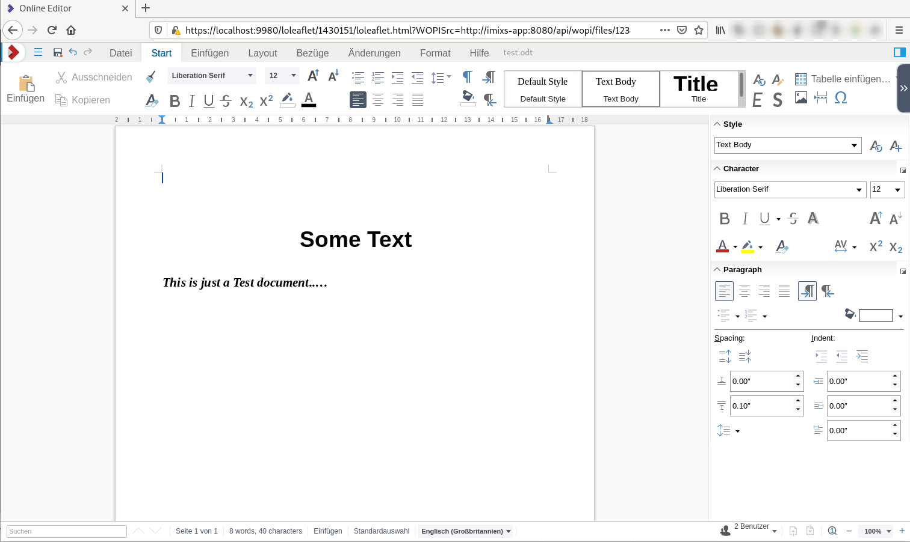

# Imixs WOPI

This adapter module provides a WOPI Host Implementation based on the [WOPI API](https://wopi.readthedocs.io/projects/wopirest/en/latest/). The adapter can be used to integrate WOPI Clients like LibreOffice Online to edit and view office Documents.

## The Rest API

The WOPI Adapter module pvovices a Rest API with the following endpoints: 

| Method |URI                           | Description                               					   | 
|--------|------------------------------|------------------------------------------------------------------|
| GET    | /wopi/files/{name}           | returns a JSON object providing information about the file {name}. It will be called by LibreOffice Online to know what kind of document will be shown in the editor          |
| GET    | /wopi/files/{name}/contents  | endpoint providing the raw data of the file. The endpoint is called by LibreOffice Online to open the file.          |
| POST   | /wopi/files/{name}/contents  | endpoint called by LibreOffice Online when the user what save a file.    |

### Security

The /wopi/ Rest API endpoint must not be protected because LibreOffice has no mechanism to authenticate against a WOPI Host. You need to make sure the endpoint is not protected by the web.xml.

To validate user access the imixs-adapter-wopi module provides an JWT implementation to generate and to validate an access token. The endpoint uri to access the HOST looks like this:

	https://localhost:9980/{libreoffice-editor}.html?WOPISrc=http://wopi-app:8080/api/wopi/files/{your-file}?access_token={JWT} 

# Development

## Maven

The imixs-adapter-wopi module can be added into an application module. The module provides CDI and Rest API components. 

Add the following maven dependency into a parent project:

	<!-- POI Adapter -->
	<dependency>
		<groupId>org.imixs.workflow</groupId>
		<artifactId>imixs-adapters-wopi</artifactId>
		<version>${org.imixs.adapters.version}</version>
		<scope>provided</scope>
	</dependency>

**Note:** The WopiHostService needs manager access. So you need to tweak your deployment descriptors accordingly.

# Integration

The Imixs-WOPI Adapter provides a JavaScript library for  a tightly coupling with the Imixs Workflow Engine. To integrate your JSF page you can simply load the script and provide a DIV element to show the editor:

	
	
	
	
	....
	...........
	
	<!-- Script called when a file was updated -->
	<h:commandScript name="wopiControllerUpdateFile" action="#{wopiController.updateFile()}" onevent="someUI-UpdateMethod" />
	
	
	<!-- show no attachments from workitem -->
	<ui:param name="fileDataList" value="#{workflowController.workitem.fileData}"></ui:param>
	<ul>
		<ui:repeat value="#{fileDataList}" var="fileData">
			<li>#{fileData.name} -> <a href="javascript:void;" onclick="imixsWopi.openViewer('#{wopiController.getWopiAccessURLByFileName(workflowController.workitem.uniqueID,fileData.name)}');"> Edit</a></li>
		</ui:repeat>	
	</ul>
	
	

		<!--the place where the editor is loaded.... -->
	

## Updating the File Content

When a file was saved by LibreOffice Online, the data is posted to the WOPI Host endpoint '/wopi/files/{name}/contents'. The file content is not directly stored. It is cached by the application scoped WopiAccessHandler. Triggered by a JavaScrict event the WopiController method 'updateFile' is called and the data is stored in the Imixs FileUploadController in the usual way. An Imixs-Workflow application has the full control how to handle the data. This way of implementation is necessary, because the Collabora Server did not handle the JSESSIONID in a way that the WopiHostService can consume the data directly in the context of the current user session. To solve this problem, the  imixs-wopi.js reacts on the 'UI_Save' and  the data is fetched from the application cache by the JSESSIONID prvided by the Collabora back end call. 

The JSF commandScript can also trigger an additional javaScript method to update the DownloadSeciton.

	<h:commandScript name="wopiControllerUpdateFile" action="#{wopiController.updateFile()}" onevent="updateDownloadSection" />

## Reacting on Events

LibreOffice Online sends JavaScript general events each time an update of the content is performed by the user. 
A javaScript can react on these events be registering a EventListner:

	/**
	 * Register a message listener
	 */
	$(document).ready(function() {
		//  Install the wopi message listener.
		// receive messages form libreoffice online
		window.addEventListener("message", receiveMessage, false);
	});
	
	// This function is invoked when the iframe posts a message back.
	function receiveMessage(event) {
		console.log('==== framed.doc.html receiveMessage: ' + event.data);
		... do something....
	}

# More...

See: https://people.gnome.org/~michael/data/2020-02-01-web-collaboration.pdf

Example HTML/IFrame : https://github.com/LibreOffice/online/blob/master/loleaflet/html/framed.doc.html

	