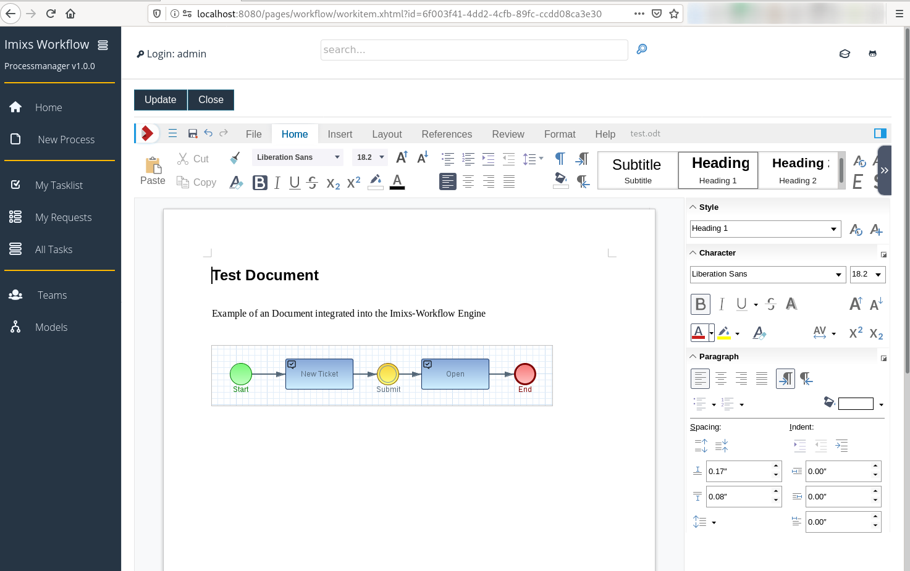

# Imixs WOPI

This adapter module provides a WOPI Host Implementation based on the [WOPI API](https://wopi.readthedocs.io/projects/wopirest/en/latest/). The adapter can be used to integrate WOPI Clients like LibreOffice Online to edit and view office Documents.

## The Rest API

The WOPI Adapter module provides a Rest API with the following endpoints. The endpoints are based on the WOPI API. 

| Method |URI                           | Description                               					   | 
|--------|------------------------------|------------------------------------------------------------------|
| GET    | /wopi/files/{name}           | returns a JSON object providing information about the file {name}. It will be called by LibreOffice Online to know what kind of document will be shown in the editor          |
| GET    | /wopi/files/{name}/contents  | endpoint providing the raw data of the file. The endpoint is called by LibreOffice Online to open the file.          |
| POST   | /wopi/files/{name}/contents  | endpoint called by LibreOffice Online when the user what save a file.    |

### Security

The WOPI API endpoints /wopi/ must not be protected because LibreOffice has no mechanism to authenticate against a WOPI Host. You need to make sure the endpoint /wopi/ is not protected by the web.xml.

To validate user access the imixs-adapter-wopi module provides an JWT implementation to generate and to validate an access token. The endpoint uri to access the HOST looks like this:

	https://localhost:9980/{libreoffice-editor}.html?WOPISrc=http://wopi-app:8080/api/wopi/files/{your-file}?access_token={JWT} 

# Integration

The Imixs-WOPI Adapter provides services and a JavaScript library for  a  tightly coupling with the Imixs Workflow Engine. The following section shows how to integrate the Imixs-WOPI Adapter into a application. A prerequisite is that an instance of a WOPI client (e.g. LibreOffice Online) is running. 

## Environment 

To setup the Imixs-WOPI Adapter the following environment variables must be set:

| Variable              | Description  							| Example |
| --------------------- |---------------------------------------|---------|
| WOPI_PUBLIC_ENDPOINT  | Public client endpoint to be called by the web appliacation. This endpoint should be SSL encrypted |https://libreoffice.foo.com/loleaflet/6a844e4/loleaflet.html?
| WOPI_HOST_ENDPOINT    | Internal Wopi Host endpoint is called by the Wopi Client to fetch and store file data. This endpoint should not be public accessible | http://my-app:8080/api/wopi/
| WOPI_DISCOVERY_ENDPOINT | Optional public discovery endpoint used by the Wopi Host implementation to resolve the public wopi endpoint dynamically. This variable should only be set if no WOPI_PUBLIC_ENDPOINT was defined! | http://localhost:9980/hosting/discovery
| WOPI_FILE_EXTENSIONS | Optional comma separated list of file extensions to be supported. |.odt,.doc,.docx,.docm,.rtf,.ods,.xls,.xlsx,.odp,.ppt,.pptx,.odg,.dxf,.emf,.wmf,.vsd,.vsdx|     
     
The following example shows a setup for in a Docker Compose file running in a local dev environment:

	....
	  my-app:
	    image: imixs/imixs-office-workflow
	    environment:
	      ....
	      WOPI_PUBLIC_ENDPOINT: "http://localhost:9980/loleaflet/6a844e4/loleaflet.html?"
	      WOPI_HOST_ENDPOINT: "http://my-app:8080/api/wopi/"    
	    ....
	    ports:
	      - "8080:8080"
	....	      

In a productive environment, the WOPI_PUBLIC_ENDPOINT should be set to a SSL encrypted Internet domain name:

	....
	  my-app:
	    image: imixs/imixs-office-workflow
	    environment:
	      ....
	      WOPI_PUBLIC_ENDPOINT: "https://libreoffice.foo.com/loleaflet/6a844e4/loleaflet.html?"
	      WOPI_HOST_ENDPOINT: "http://my-app:8080/api/wopi/"    
	    ....
	    ports:
	      - "8080:8080"
	....	  

## Maven

The imixs-adapter-wopi module can be added into an Imixs Workflow application. The module provides CDI and Rest API components. 

Add the following maven dependency into a parent project:

	<!-- POI Adapter -->
	<dependency>
		<groupId>org.imixs.workflow</groupId>
		<artifactId>imixs-adapters-wopi</artifactId>
		<version>${org.imixs.adapters.version}</version>
		<scope>provided</scope>
	</dependency>

**Note:** The WopiHostService needs manager access. So you maybe need to tweak your deployment descriptors accordingly. Also make sure that the Rest API endpoint /api/wopi/ is not protected by JAAC. 

## The WopiController

To open the LibreOffice Online Editor you need a access url including the Wopi Host Endpoint and the access token. The CDI Bean WopiController provides a convenient method to generate such a URL:

	 <a href="javascript:void;"
	    onclick="imixsWopi.openViewer('wopi_canvas','#{wopiController.getWopiAccessURL(uniqueID,filename,userid,username)}');">
	    Edit</a>

In this example we are calling the JavaScript method to open the viewer component in a iframe. See details in the following section.

## JavaScript

The Imixs-WOPI Adapter provides a JavaScript library to open and control the Wopi Editor (Wopi Client).
The Integration of the Wopi Client into your application is done by a iframe. This necessary to isolate the editor form your surrounding application. 
To display the editor in a iframe the script library *imixs-wopi.js* provides a method imixsWopi.openViewer. The method expects a DIV element in your existing web page and the access URL to place the iframe with the editor. 

	
	
	

	....
	...........
	<!-- LibreOffice Editor -->
	

		<button onclick="imixsWopi.save(); return false;">Update</button><button onclick="imixsWopi.closeViewer(); return false;">Close</button>
		

	

	

	....

## UI Controlls

The control of closing the editor or saving the content is in this concept part of your application. So in the example above the application shows two buttons to save the content and to close the editor. 

## Updating the File Content

When a file was saved by LibreOffice Online, the data is posted to the WOPI Host endpoint '/wopi/files/{name}/contents'. The file content is not directly stored. It is cached by the application scoped WopiAccessHandler. Triggered by a JavaScript event the WopiController method 'updateFile' is called and the data is stored in the Imixs FileUploadController in the usual way. An Imixs-Workflow application has the full control how to handle the data. 

The WopiController also provides a Ajax method to update the Imixs FileUploadController after a document was saved. You can integrate the
controller method with a JSF commandScript: 

	<!-- Script called when a file was updated -->
	<h:commandScript name="wopiControllerUpdateFile" action="#{wopiController.updateFile()}" onevent="someUI-UpdateMethod" />

The  JavaScript library automatically detects the existence of the method wopiControllerUpdateFile and calls the method after a file was updated and saved. 

The JSF commandScript can also trigger an additional javaScript method to update the DownloadSeciton.

	<h:commandScript name="wopiControllerUpdateFile" action="#{wopiController.updateFile()}" onevent="updateDownloadSection" />

## Reacting on PostMessage Events

LibreOffice Online sends JavaScript general events each time an update of the content is performed by the user. 
A javaScript can react on these events be registering a EventListner:

	/**
	 * Register a message listener
	 */
	$(document).ready(function() {
		//  Install the wopi message listener.
		// receive messages form libreoffice online
		window.addEventListener("message", receiveMessage, false);
	});
	
	// This function is invoked when the iframe posts a message back.
	function receiveMessage(event) {
		console.log('==== framed.doc.html receiveMessage: ' + event.data);
		... do something....
	}

You can also send messages to the editor 

	imixsWopi.postMessage({
			"MessageId" : "Action_Save",
			"Values" : {
				"DontTerminateEdit" : true,
				"DontSaveIfUnmodified": false,
				"Notify" : true
			}
		});

Find more details about the Post Message in Collaboara [here](https://sdk.collaboraonline.com/docs/postmessage_api.html).

## Example Application

You can find a full demo integration in the 'wopi-host' branch of the [Imixs-Process-Manager project](https://github.com/imixs/imixs-process-manager/tree/wopi-host).

	